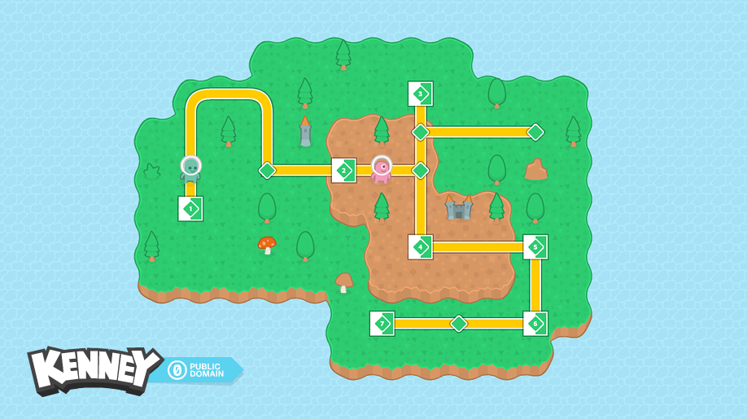
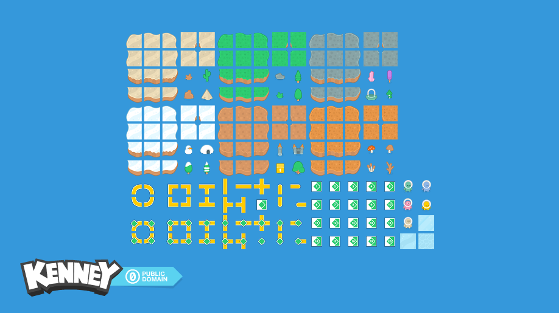

# Wave Function Collapse Map

A Phaser/JavaScript project for building a tile-based procedural map generator using the Wave Function Collapse algorithm.

This repo currently contains the starter scaffold for the assignment: Phaser loads successfully, the Kenney map assets are available, and `main.js` defines the tile/decor constants we will use while building the WFC logic.



## Project Goal

Generate a tile map that is at least 20 tiles wide and 15 tiles tall, with:

- Water and land terrain
- Transition tiles between terrain types
- At least two kinds of decorations, such as trees and buildings
- A fresh generated map when the program starts
- `R` key support to regenerate the map

## Assets

This project uses the Kenney map pack, which includes terrain tiles, transitions, roads, buildings, trees, props, and other decorations.



The current scaffold uses tile definitions for:

- Water
- Grass
- Dirt
- Grass-to-water transition tiles
- Dirt-to-grass transition tiles
- Decorations like trees, towers, castles, and mushrooms

## Current Status

Implemented so far:

- Phaser scene setup
- Kenney map pack atlas loading
- Tile size and map dimension constants
- Terrain tile definitions for water, grass, dirt, and transitions
- Decoration definitions
- Placeholder water map rendering

Still to build:

- Wave Function Collapse grid/cell state
- Tile compatibility checks
- Collapse and propagation logic
- Map regeneration with the `R` key
- Decoration placement pass

## Planned WFC Approach

The map generator will treat each grid cell as a set of possible tiles. Each tile has labeled edges, such as `water`, `grass`, or `dirt`. A tile can sit next to another tile only when their touching edges match.

The basic loop we plan to build:

1. Start every map cell with all possible tiles.
2. Pick the cell with the fewest remaining possibilities.
3. Collapse that cell to one tile.
4. Remove incompatible options from neighboring cells.
5. Repeat until every cell has one tile.

Decorations will probably be placed in a second pass after the terrain is generated, which keeps the first WFC version easier to reason about.

## Running Locally

Because the project loads image and atlas assets, run it through a local web server instead of opening `index.html` directly.

From the project folder:

```bash
python3 -m http.server 8000
```

Then open:

```text
http://127.0.0.1:8000/
```

## Files

- `index.html` - Loads Phaser, the game script, and the page container.
- `main.js` - Contains the Phaser scene, tile constants, decoration constants, and placeholder map rendering.
- `assets/` - Kenney map pack tiles, atlas, previews, and license.

## Controls

Current controls:

- No gameplay controls yet.

Planned controls:

- `R` - Regenerate the map.
- `+` / `-` - Optional zoom controls.

## Credits

Tile art is from the Kenney map pack. See `assets/License.txt` for license details.
